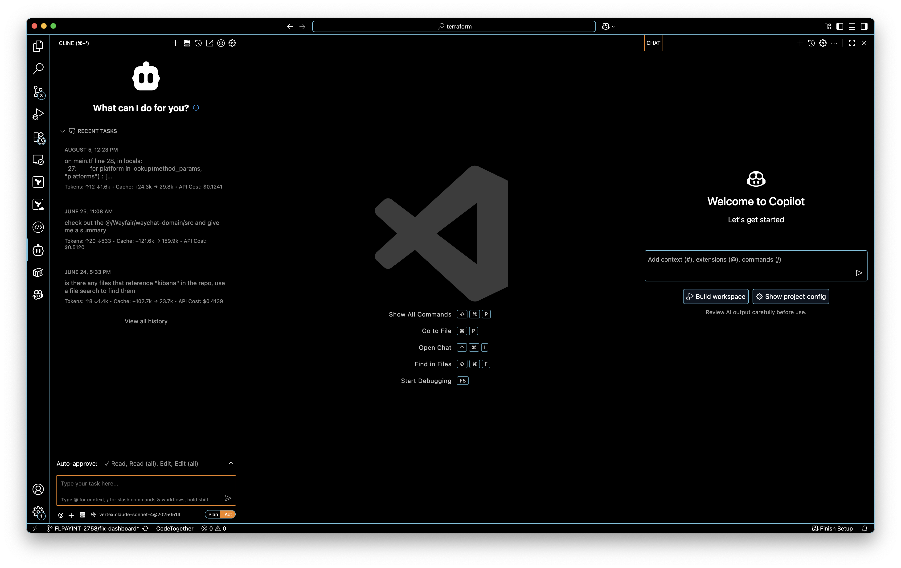
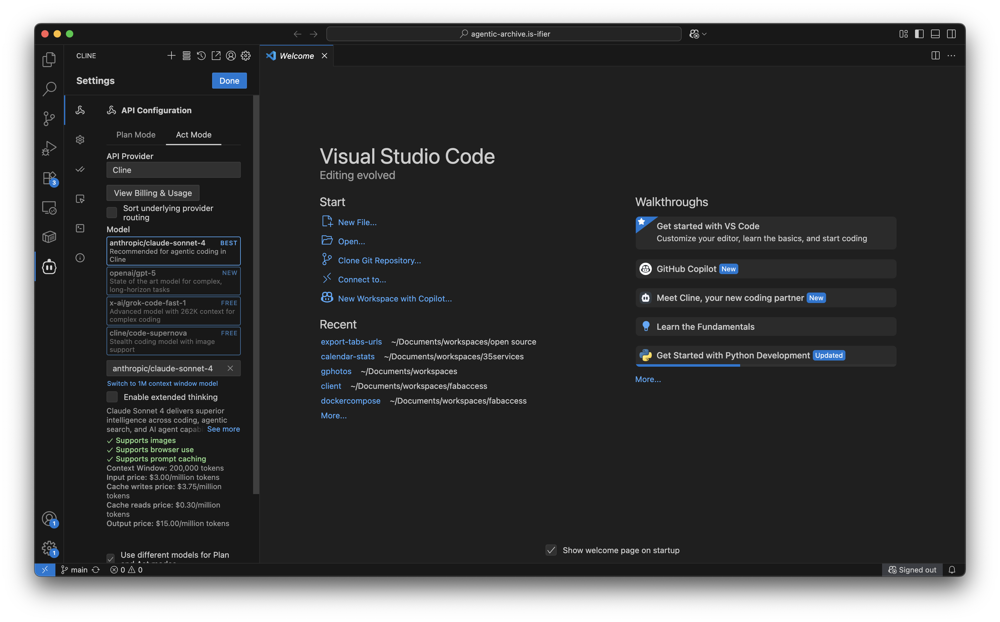
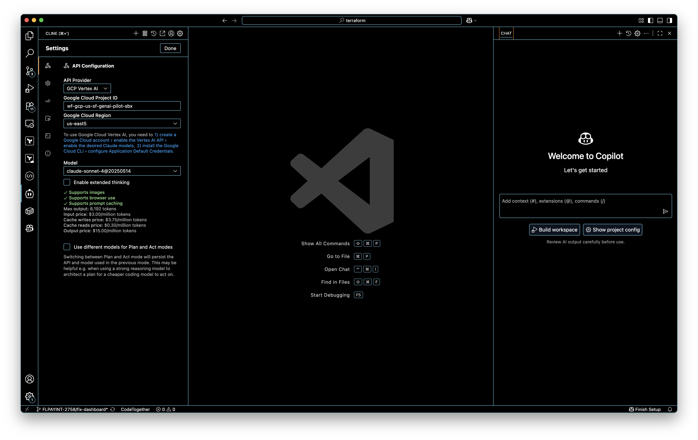
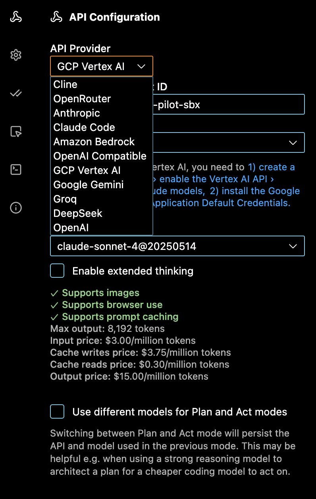

footer: © Falko Richter - This presentation was built *without* AI
slidenumbers: true

# TechTalk: Vibe Coding

---

## About me

* International Media Informatics HTW 🌎
* 16 Years IT - crossfunctional IC/EM/Product
	* TIC-mobile/Sinnerschrader/Accenture, Sensorberg (IOT), Kitchenstories 👨‍🍳 Wayfair (🇺🇸 furniture retailer)
* 35services 🧰 KTG Elementary School 🚸 Berlindroid 🤖
* Cargo bikes 🚴‍♂️ Quadcopters ✈ Podcaster, Dad of 2 👧 

---

* German, questions welcome in English
* This is being recorded, presentation will be available at the end ([open source](https://github.com/falkorichter/presentations/blob/main/agentic%20101/README.md))
* Q&A at the end
  * Florian is taking notes for Q&A topics
* 90 minutes, Florian keeps track of time :)

### Questions?

---

## What do you already know?

* Which AI use cases are you already using (privately)
* Vibe coding?

---

## IT Milestones
* personal computer / internet
* web 2.0
* iPhone
* cloud
* ?

---

# Terms

- OpenAI, Anthropic (Companies)
- ChatGPT, [claude](https://claude.ai/) (Products)
- GPT-4, Gemini 2.5 Pro, Claude Sonnet 4, Claude Opus 4.1 (LLMs)

...

---

## vibe coding

# What is this actually?

[x.com/karpathy](https://x.com/karpathy/status/1886192184808149383)

"There's a new kind of coding I call "vibe coding", where you fully give in to the vibes, embrace exponentials, and forget that the code even exists."

---

> Vibe Coding refers to a type of software development in which almost exclusively the prompt of a large language model is served in order to generate the source code required for the software.
> 
> 
> Vibe Coding works with the tools of prompt engineering. Unlike qualified software development, which includes checking and testing the source code and the product for error-free operation by specialists, Vibe Coding should not require any prior knowledge or training.
--  [de.wikipedia.org/wiki/Vibe_Coding](https://de.wikipedia.org/wiki/Vibe_Coding)

---
## vibe coding

### "Pure" Vibe-Coding: 
In its most exploratory form, the user completely trusts that the AI output will work as intended. As Karpathy put it, it's like "forgetting that the code even exists". Therefore, this method is best suited for rapid ideation or for what he calls "weekend projects" where speed is the primary concern. [cloud.google.com](https://cloud.google.com/discover/what-is-vibe-coding?hl=de)

---

## ~~vibe coding~~ **agentic coding**

### Responsible AI-assisted development:
"This is about the practical and professional application of the concept. In this model, AI tools act as powerful support or 'pair programmer'. The user gives instructions to the AI, reviews, tests and understands the generated code and takes full responsibility for the end product." [cloud.google.com](https://cloud.google.com/discover/what-is-vibe-coding?hl=de)

---

## Tried for you: tools

* [Cursor](https://cursor.com/) (VS fork)
* windsurf ([VS fork](https://windsurf.com/editor) with integration, [plugins](https://windsurf.com/plugins))
* [github CoPilot](https://github.com/features/copilot) (online)
* [cline.bot](https://cline.bot/) (VS code plugin)
* gemini
* notebookLM -> knowledge management
   * `35services` [link](https://notebooklm.google.com/notebook/be006e4a-dcd2-4c13-894c-1f165020c52e)
   * `35services Taxes` [link](https://notebooklm.google.com/notebook/2a477e34-a6c9-48ae-b563-e79b01de4a56)
   * `Google and other podcasts` [link](https://notebooklm.google.com/notebook/2c344d3e-8a01-4fc4-a566-9b0c5ffb2cf3)

---

## Tried for you: use-cases

* "pure" vibe coding" / "Responsible AI-assisted development"
* code completion/ review (copilot, gemini, cursor)
* Writing [ADRs](https://github.com/joelparkerhenderson/architecture-decision-record) and RFCs
* (Security) reviews (`Android -> PHP -> Microservice`)
* Diagrams

Generate images, edit images (👻)


---

## LLM

* large language model / Language Model
* Programming == Language
* trained with GIT histories `->` Programming processes

`LLMs are very good at duplicating solutions to problems that have already been solved. So basic programming patterns are very easy for it to spit out.`

---

> Well.. one obvious reason is that this is what they were trained of, so this is what they excel at. An LLM is essentially a completion algorithm, that must adhere to the same alphabet soup it has swallowed during its training.
-- Asaf Atzmon [beeblebrux.medium.com/llms-are-all-the-vibe-but-whats-next-c653d5b7cae5](https://beeblebrux.medium.com/llms-are-all-the-vibe-but-whats-next-c653d5b7cae5)

---

## Components / how does it work?
* frontend/app
   * Integrations
   * MCP
* llm
	* local / remote [Vertex.ai](https://cloud.google.com/vertex-ai?hl=de)...



[VS Code](/Applications/Visual\ Studio\ Code.app/Contents/MacOS/Electron)

---



---


---



---



---


* feedback loop
* multi agent
* plan / act mode
* background mode


---

# Other tools:
* [goose](https://block.github.io/goose/) (command line)
* [junie from Jetbrains](https://www.jetbrains.com/de-de/junie/) (plugin)
* [claude code](https://claude.com/product/claude-code) (command line)
* [cursor CLI](https://cursor.com/de/docs/cli/overview)
* [cline plugins](https://docs.cline.bot/getting-started/installing-cline) in other IDEs (VS Code, JetBrains IDEs)

---

## MCP

* [https://claude.ai/share/d5385d25-9238-4f20-afd8-1835ddf5e909](https://claude.ai/share/d5385d25-9238-4f20-afd8-1835ddf5e909)
* [server-concepts#how-tools-work](https://modelcontextprotocol.io/docs/learn/server-concepts#how-tools-work)

```
/**
   * Returns comprehensive tool definitions optimized for AI agent interaction.
   * Tools are categorized and include detailed usage guidance, examples, and workflow patterns.
   */
  listTools(): Promise<{ tools: MCPToolDto[] }> 

  async callTool(name: string, args: any): Promise<any>
```
* [github.com/falkorichter/fairsplit/blob/main/src/mcp/mcp.service.ts#L33](https://github.com/falkorichter/fairsplit/blob/main/src/mcp/mcp.service.ts#L33)


---

## case study 1: Building a Chrome plugin

---
## case study 1: Building a Chrome plugin
#### product briefing
[https://github.com/falkorichter/agentic-archive.is-ifier](https://github.com/falkorichter/agentic-archive.is-ifier)


* [https://github.com/falkorichter/agentic-archive.is-ifier/commit/1e1de4979801079e9404a4297a7b4aeedc4e520b](https://github.com/falkorichter/agentic-archive.is-ifier/commit/1e1de4979801079e9404a4297a7b4aeedc4e520b) initial README

---
## case study 1: Building a Chrome plugin
#### github copilot
   * pull request [https://github.com/falkorichter/agentic-archive.is-ifier/pull/2](https://github.com/falkorichter/agentic-archive.is-ifier/pull/2)
   * [https://github.com/falkorichter/agentic-archive.is-ifier/pull/2/agent-sessions/63746a6c-0dde-4a6f-a928-87fad3e00952](https://github.com/falkorichter/agentic-archive.is-ifier/pull/2/agent-sessions/63746a6c-0dde-4a6f-a928-87fad3e00952)

---
   
* "Now let me test the extension by taking a screenshot using a browser to verify it works correctly. First, let me open the extension in a browser:" [deeplink](https://github.com/falkorichter/agentic-archive.is-ifier/pull/2/agent-sessions/63746a6c-0dde-4a6f-a928-87fad3e00952#:~:text=Now%20let%20me%20test,playwright%2Dmcp%2Dserver%2Dbrowser_navigate)
* "Now let me create a basic icon. I'll create a simple PNG with "is!" text:"
* "Now let me test the extension by taking a screenshot using a browser to verify it works correctly. First, let me open the extension in a browser:"

---

```text
Error: page.goto: net::ERR_BLOCKED_BY_CLIENT at file:///home/runner/work/agentic-archive.is-ifier/agentic-archive.is-ifier/test.html Call log:

navigating to "file:///home/runner/work/agentic-archive.is-ifier/agentic-archive.is-ifier/test.html", waiting until "domcontentloaded"
```

---

## case study 1: Building a Chrome plugin
### building tests

Tests were there from the beginning 💪

`Can we setup github CI for the project please to ensure tests are run as part of the PR` [issues/3](https://github.com/falkorichter/agentic-archive.is-ifier/issues/3)
* [tests/test-runner-headless.js](https://github.com/falkorichter/agentic-archive.is-ifier/pull/4/files#diff-445db4a234ffa5f8a0a5822dc73e2b4d75ff94b4771ecb1ba92e1a975c38baaf)
* [/main/tests/test-functions.js#L322](https://github.com/falkorichter/agentic-archive.is-ifier/blob/main/tests/test-functions.js#L322)
* [live](file:///Users/falkorichter/Documents/workspaces/open%20source/agentic-archive.is-ifier/tests/test.html) 


---

## Hallucinations

[Example](https://github.com/falkorichter/agentic-archive.is-ifier/pull/43/files#diff-b335630551682c19a781afebcf4d07bf978fb1f8ac04c6bf87428ed5106870f5R255)

[https://github.com/falkorichter/agentic-archive.is-ifier/issues/34](https://github.com/falkorichter/agentic-archive.is-ifier/issues/34)

---

## copilot suggests

[https://github.com/falkorichter/agentic-experiences/pull/2#issuecomment-3192211640](https://github.com/falkorichter/agentic-experiences/pull/2#issuecomment-3192211640) copilot actions

> @falkorichter 👋 This repository doesn't have [Copilot instructions](https://docs.github.com/enterprise-cloud@latest/copilot/how-tos/configure-custom-instructions/add-repository-instructions?tool=webui). With Copilot instructions, > I can understand the repository better, work faster and produce higher quality PRs.

> I can generate a .github/copilot-instructions.md file for you automatically. Click [here](https://github.com/falkorichter/agentic-experiences/issues/new?title=✨+Set+up+Copilot+instructions&body=Configure%20instructions%20for%20this%20repository%20as%20documented%20in%20%5BBest%20practices%20for%20Copilot%20coding%20agent%20in%20your%20repository%5D%28https://gh.io/copilot-coding-agent-tips%29%2E%0A%0A%3COnboard%20this%20repo%3E&assignees=copilot) to open a pre-filled issue and assign it to me. I'll write the instructions, and then tag you for review.


---


## 2 fairsplit

https://github.com/tobiasheine/fairsplit/pull/40

> * 🎯 Product Agent: Requirements gathering and story grooming
> * 💻 Development Agent: Code implementation and architecture
> * 🧪 Testing Agent: Quality assurance and test creation
> * 🚀 DevOps Agent: Deployment and infrastructure management
> * 📋 Orchestrator Agent: Workflow coordination and process enforcement
[https://github.com/tobiasheine/fairsplit/blob/07ab4fd678a839bace397cf9509c10322ea6b605/CASE_STUDY_STORY.md#the-multi-agent-architecture-solution](the-multi-agent-architecture-solution)

---
### list of case studies
* huge refactoring, repetitive tasks
* AI meeting notes + notebookLM
* security analysis kotlin/PHP/java
* colleague's question
* ...

---
### my experiences

* Skepticism (Hallucinations)
* WOW 🤯 ([TiB_Verein](https://github.com/falkorichter/TiB_Verein)) - WOW 😳
* Great complement in extremely many areas
* "Your Junior developer" - or a [Staff Bug Fixing Engineer](https://medium.com/for-self-taught-developers/i-spent-6-years-as-a-senior-developer-then-ai-fixed-my-bug-in-15-minutes-thats-when-i-knew-i-94d9fef9990a) [archive.is](https://archive.is/U8F3z)

---

## Q&A

---

### Overflow

* `Mermaid Diagrams`: [cursor.com/de/docs/configuration/tools/mermaid-diagrams](https://cursor.com/de/docs/configuration/tools/mermaid-diagrams)

---

> In an AI-driven world, staying comfortable is the riskiest career move you can make. 
-- ([source](https://medium.com/for-self-taught-developers/i-spent-6-years-as-a-senior-developer-then-ai-fixed-my-bug-in-15-minutes-thats-when-i-knew-i-94d9fef9990a) [archive.is](https://archive.is/U8F3z))