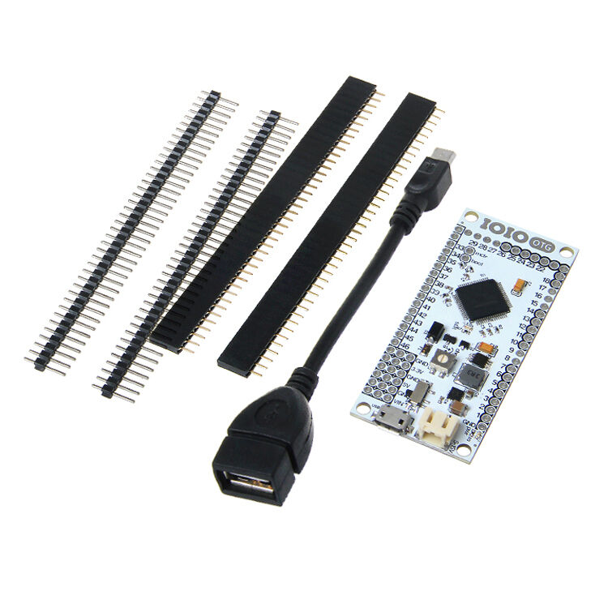
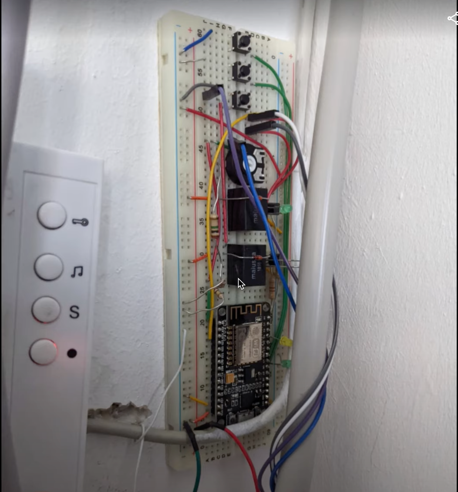
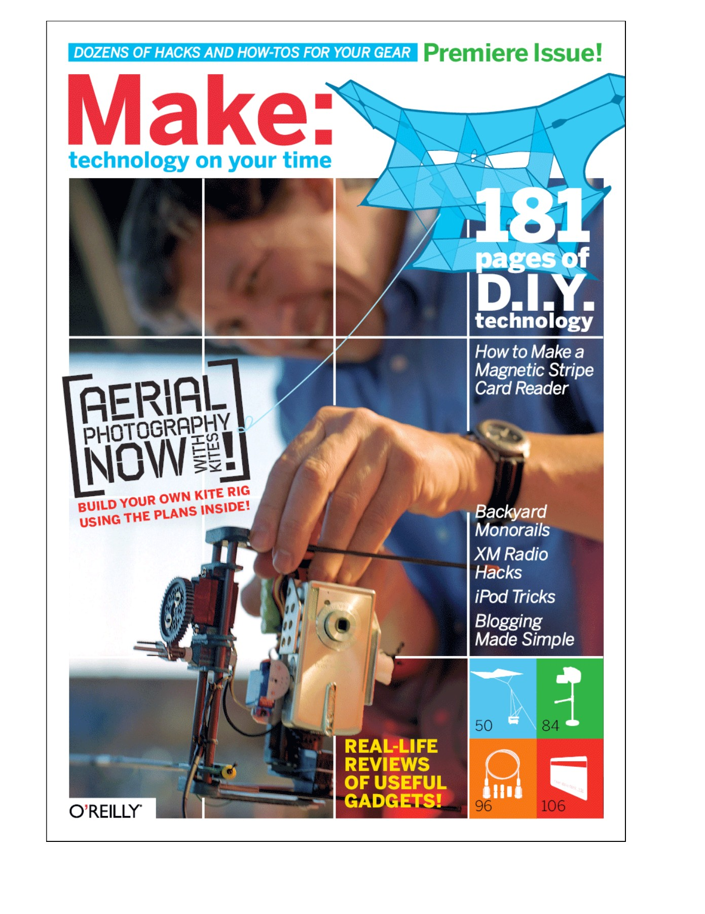
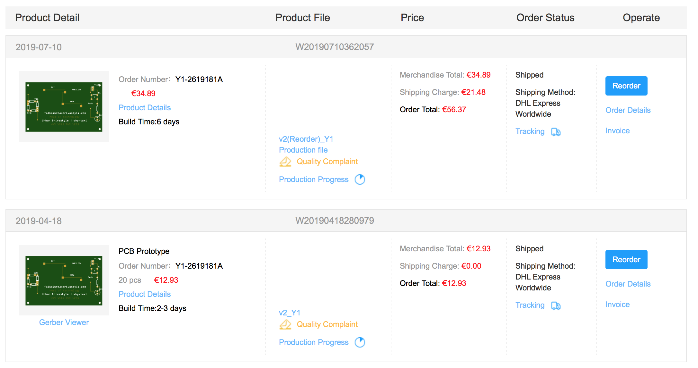
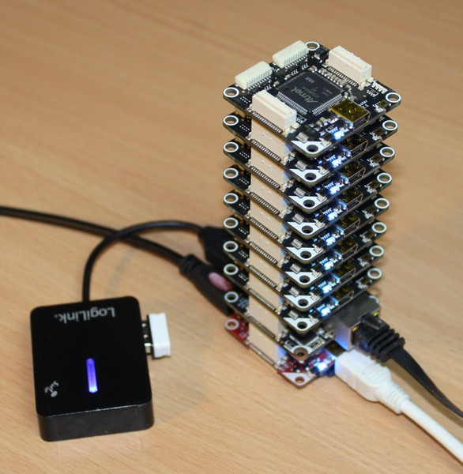
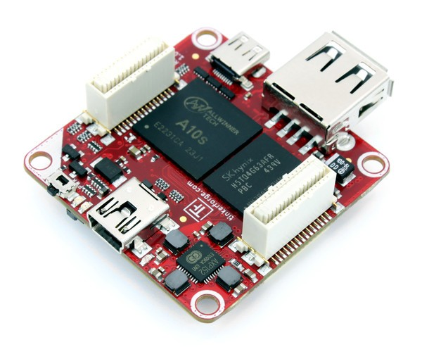
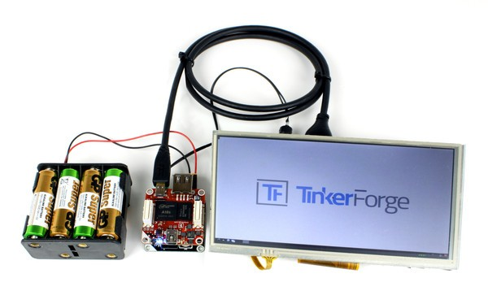
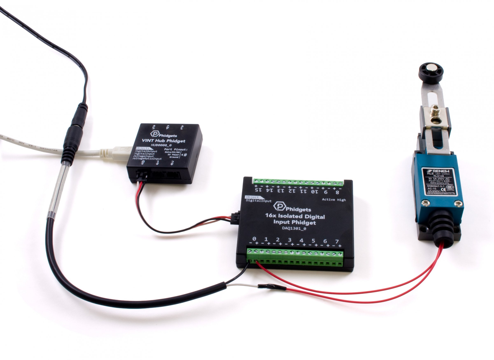
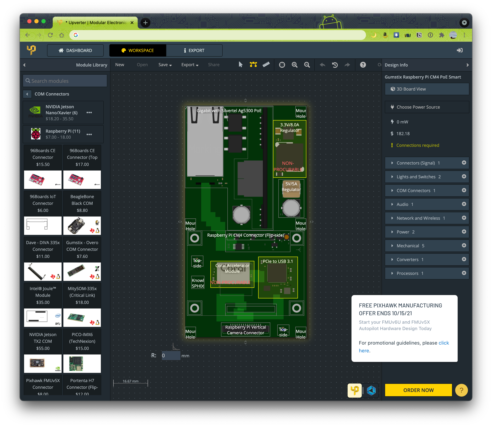
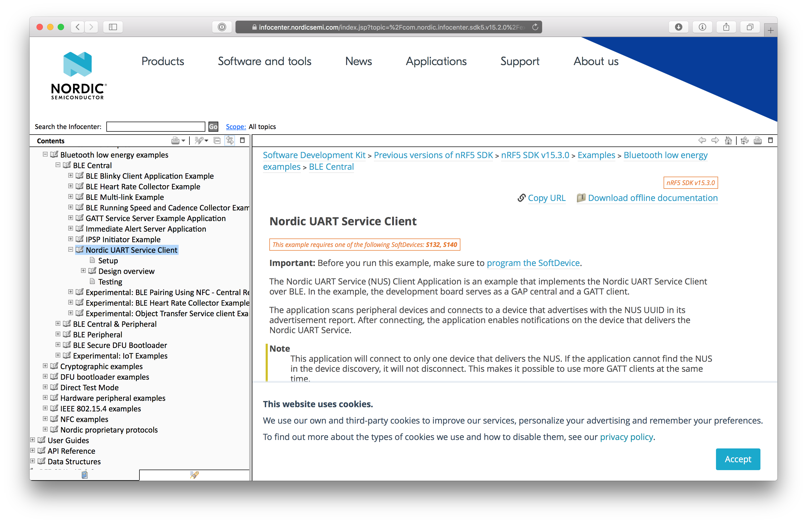

Inspired  to be submitted to the community day by the presenation of [Mario Bodemann](https://twitter.com/MarioBodemann)
http://jfdi.jetzt/_talks/pcbs-and-android/#/step-1
Recording available at https://www.droidcon.com/2021/11/10/agile-hardware-development-as-an-android-dev/

# news
https://github.com/kenp-io/not-for-iphone-usb-c made an usb-c jack for an iPhone. https://www.youtube.com/watch?v=FVEQJNRmfDQ very agile!

---

# Agile Hardware Development
####Falko Richter | Android Dev Wayfair | @volkersfreunde


---

# Agile Hardware Development
## if you can do Android, you can do hardware[^1]

######this presentation is open source: [github.com/falkorichter/presentations/blob/master/agile-hardware-development/hardware-development_droidcon2021.md](https://github.com/falkorichter/presentations/blob/master/agile-hardware-development/hardware-development_droidcon2021.md)

[^1]: Presentation made with [DecksetApp](http://decksetapp.com/) 

---
# disclaimer:

All details about hardware in this presentation can be derived from the hardware itself and do not contain any internal company secrets. Additional information was derived from public documentation.


---

Highlights in history of IOT from an Android perspective:

* IOIO ("JOJO") - **fail**
* [Accessory Development Kit](https://stuff.mit.edu/afs/sipb/project/android/docs/tools/adk/index.html)  - **fail**
* [Bluetooth (LE)](https://github.com/falkorichter/presentations/tree/master/everything-is-better-with-bluetooth)[^4] - ♥️♥️♥️
* USB(-C) - **fail**/DJI



[^4]: Everything is better with(out) Bluetooth

---

# connectivity
## Bluetooth LE
## Wifi
## NFC
## USB (see [yesterdays Talk](https://twitter.com/MarioBodemann/status/z1438048468623314945) by Mario)

---

# agile [Development](https://agilemanifesto.org/principles.html)

| Our highest priority is to satisfy the customer
through early and continuous delivery
of valuable software.

* Deliver working software frequently
* Responding to change
* Working software is the primary measure of progress
* Simplicity--the art of maximizing the amount
of work not done--is essential.


[^2]: Keep it simple, stupid

---

# iterate on hardware ❓

# iterate on software ✅

---
#case study

* [open taffeta](https://github.com/apiraino/open-taffeta)
* pi + flutter app + esp32 on board
* [explanation video in 🇩🇪](https://www.youtube.com/watch?v=p3l2qynlGgI)
* looks harder than it it really is ➡️
	* auth on phone -> ring door -> intercept signal (no ring) -> open door
* live at [cwrkng](https://www.cwrkng.de/)	
* done by Daniel from [Finke Media](https://www.finke.media/) contact him for Flutter♥️




---

# problems when iterating on hardware
* knowledge (hardware)
* tools (electronics design, os)
* manufacturing (price + speed)

---

# news

Maker movement* meets *Agile Craftsmanship* meets *Rapid electronic production* capabilities meets *China*

* [jlpcb](https://jlcpcb.com) / [aisler.net](https://aisler.net/)
* open (source) hardware
  * [tindie.com](https://tindie.com) - store for open hardware, [kicad](https://www.kicad-pcb.org/)
* platforms
  * pi / ESP / NRF
* youtube



---

# jlpcb

[50 pcb (business cards)](https://www.instagram.com/p/BwnTBbjnfw3/)
```PCB Batchs	8534009000	Y1	50	€0.6979	€34.89```



---

# prototype manufacturing

order PCB
order parts
apply solder paste
hot air
repeat


---

## open source hardware for prototyping:

buy, connect, done

[github.com/Tinkerforge](https://github.com/Tinkerforge)

<show some hardware> [how it works](https://www.tinkerforge.com/en/home/how-it-works/)

-> [Thermal camera Android code](https://github.com/falkorichter/android-tinkercad-thermalview/blob/main/app/src/main/java/de/falkorichter/tinkerforge/thermalview/ThermalImaging.kt#L65)



---
phidgets

> Phidgets are programmable, modular USB devices, either sensors or controllers that you can connect together. Simply write code in your favorite language and solve real-world problems.



---

# pi compute module
* industrial raspberry as a module
* powerful, small, not cheap
* plug and play
  * develop software on prototype, swap into final hardware
* CM4 even more projects
* CM IO board for prototyping or Raspberry Pi


---

### gumstix geppetto / modular.upverter.com

* [https://store.gumstix.com/products](https://store.gumstix.com/products)
* [https://www.gumstix.com/raspberry-pi-family/](https://www.gumstix.com/raspberry-pi-family/)

<show some hardware> [gepetto](https://geppetto.gumstix.com/#!/dashboard)



---

# NRF / serial over BTLE
nordic semi conductos
bluetooth
many open source samples [uart](https://infocenter.nordicsemi.com/topic/com.nordic.infocenter.sdk5.v15.3.0/ble_sdk_app_nus_c.html)

OpenSK: [rust anyone?](https://github.com/google/OpenSK)



---
# the last mile

ESD protection [^3]
  stay < 48V, go to a lab
Certification
  "spurious emissions"
  pre-certification helps
case
cables + connectors (avoid, use standards)
mass production


[^3]: electrostatic discharge protection

---
# nobody wants naked electronics:

* [bopla](https://www.bopla.de/dienstleistungen.html)
* [apra plast](https://www.apra.de/produktkategorie/individuelle-gehause/)
* [takachi](http://www.takachi-enclosure.com/data/p_09handheld.html)

<talk about embedded world 2018>

* 3D print, injection mold...

---

# sample platforms / talking points

* pi compute module cm4/cm4
* poe
* expandability (keypad, lockers)

---
# where to go to:

* embedded world
* electronica
* maker faires
* chaos congress/camp

---
# sources for inspiration:

* sparkfun
  * [new products](https://www.sparkfun.com/categories/new_products) [yt](https://www.youtube.com/user/sparkfun/videos)
* adafruit
  * [new products](https://www.adafruit.com/new) [yt](https://www.youtube.com/user/adafruit/videos)
* Jeff Geerling ([blog](https://www.jeffgeerling.com/tags/cm4), https://www.youtube.com/watch?v=DHwL1_afSn8&list=PL2_OBreMn7FqeHztTB3BCMGJ_dx1jEK3f)
* single board computers https://youtu.be/u7F2INkWQ5E
---

#Thank you

## [@volkersfreunde](https://twitter.com/volkersfreunde)
## find me at the [berlindroid](https://berlindroid.de/) booth
## Wayfair is looking for [talented engineers](https://www.wayfair.de/careers/jobs/?gh_src=a5f36eaa2&keywords=&locationIds=2&stateIds=&countryIds=2)
## open source your hardware


---

#overflow

* Fab-Zugangssysteme
	* Telegram group
	* [FabAccess/FabInfra](https://fab-access.org/de/projects/fabaccess/)
