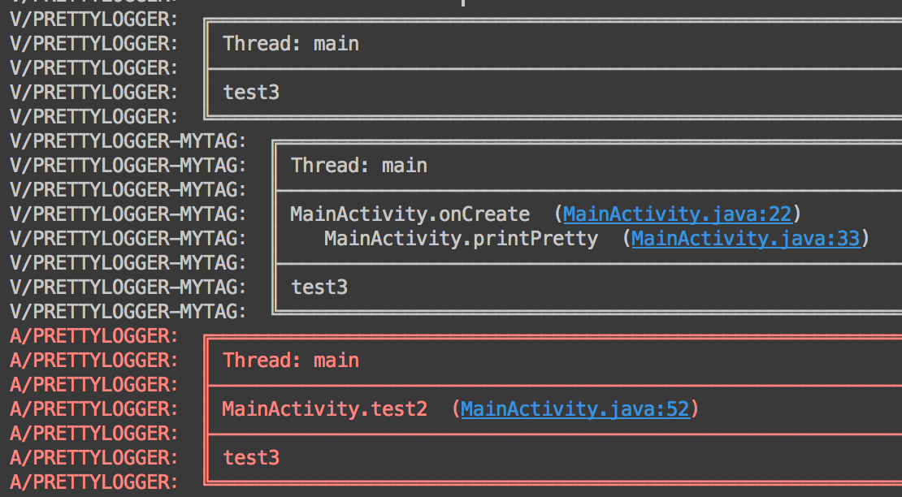
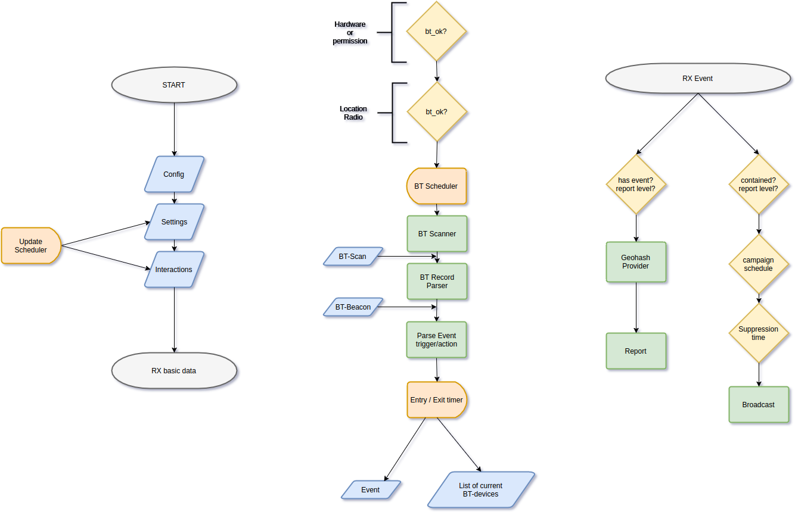
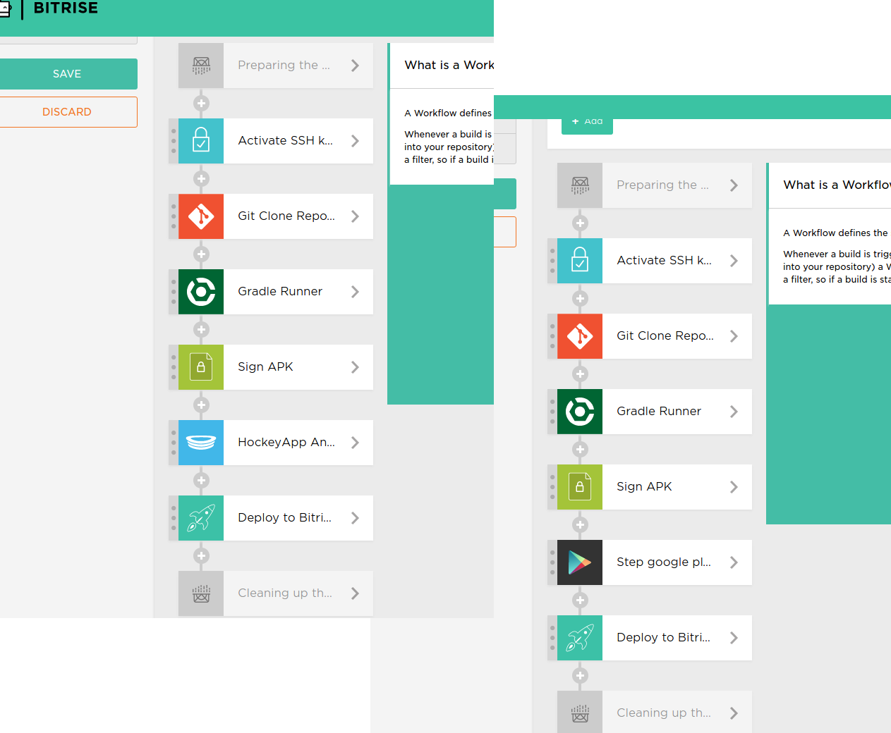

# Building a SDK[^1]
### learnings from building the sensorberg Android SDK
```
git clone https://github.com/falkorichter/presentations
cd building-a-SDK
```
##### pull requests are welcome!


[^1]: Presentation made with [DecksetApp](http://decksetapp.com/) 

---

#about sensorberg

* integrate proximity interactions in your apps
* complete solution
	* iOS, Android, (Windows SDK)
	* Showcase apps, Utilities
	* Rule management backend + frontend
	* iBeacon, geofence, ...
* lot´s of open source software

WE`RE HIRING -> jobs.sensorberg.com

---

# [fit] about us ①

github.com/budius
@ronaldopace
android software developer @ Sensorberg & proud dad since 2016

---
# [fit] about us ②
github.com/falkorichter
@volkersfreunde
mobile software developer @ Sensorberg & proud dad since 2015
[about.me/falkorichter](http://about.me/falkorichter)
pilot of small things™

---

#awwww ①


---

#awwww ②


---

#Building a SDK

[open source](https://developer.sensorberg.com/android/) at developer.sensorberg.com/android/
many learnings and good practices
all samples from actual problems
all code (used to be) live

---

#general thoughts

listen to your customers
new features tailored to individual customers
don´t listen to customers, you are the expert
release early, release often (at least internally)

---


#think twice
#about everything

> sure let´s move this class, wait, a customer is using it, all his code will not compile...


his imports are broken

---

#logging ①


ship a powerful logging engine!
domain logging output
disable all log output by default
logging can be turned on

* log to file, send to developers...
* log to server

~~[write your own logging wrapper](https://github.com/sensorberg-dev/android-sdk/blob/v2.0.0/android-sdk/src/main/java/com/sensorberg/sdk/Logger.java)~~


---

#logging ②

https://github.com/orhanobut/logger
https://github.com/budius/logger

* (fork with non-static methods)[https://github.com/budius/logger/commits/feature/printer_instance]
* (option for file logging)[https://github.com/orhanobut/logger/pull/104]



---

#testing

no fancy setup

recently switched to Espresso 2.0 with JUnit 4

add your own testrunner from the very start

test on devices

---

#build an app


be your own customer

build your own sample apps

build lot´s of samples

answer integration question with samples

"developer mode"

---

#releasing

jcenter ftw | jitpack |

~~your own public nexus~~

~~github pages~~


---

#github pages[^6]

check **[uploadGithub.gradle](https://github.com/falkorichter/presentations/blob/master/building-a-SDK/uploadGithub.gradle)** and **[verifyTasks.gradle](https://github.com/falkorichter/presentations/blob/master/building-a-SDK/verifyTasks.gradle)**[^7]

 * manual verification tasks
 * clone repo, deploy artifact locally, push to mvn-repo
 * be strict: don´t remove releases, don´t override releases

```
repositories {
	maven { url "https://raw.github.com/sensorberg-dev/android-sdk/mvn-repo";
}}
```
[^6]: don´t try this at home
[^7]: https://github.com/falkorichter/presentations/blob/master/building-a-SDK/

---

#jitpack.io

> Easy to use package repository for GitHub


---


#architecture ①

* everything should be testable (if you need to)
* ~~mock sever requests~~
* ~~mock device callbacks~~
* ~~blocking threading for tests~~
* RxJava

---

#architecture ②



---

#architecture ③

* modularize your library, interfaces, "tiny bit of reflection"
* BaseSDK
	* Feature Modules (beacon trigger, wifi trigger single-board-computer optimizations)
* != [GooglePlayServices](https://developers.google.com/android/guides/setup)
	* com.google.android.gms:play-services-plus:10.0.1
	* com.google.android.gms:play-services:10.0.1

---


##Dependency injection

do.it.

---

#Settings.java

have many internal settings
build an API for remote changing them

document them to individual customers/users
good for testing as well

auto-generate and auto-fill POJO from Json and merge from API response
make it simple/fast to add as many settings as needed

---

#feature flags

use the settings or other measures.
ship code early, activate later
test on production code

TBD: V3 modularization might be the better solution

---


#secret codes

```
*#*#code#*#* in the dialer
```
* enable features at runtime
* no persistence needed
* good for switching environments, enabling logging
* [SensorbergCodeReceiver.java](https://github.com/sensorberg-dev/android-sdk/blob/v2.0.0/android-sdk/src/main/java/com/sensorberg/sdk/receivers/SensorbergCodeReceiver.java) and [AndroidManifest.xml](https://github.com/sensorberg-dev/android-sdk/blob/v2.0.0/android-sdk/src/main/AndroidManifest.xml#L41)


---

#reviews

external security reviews might make sense
* manifest metadata is not secure ~~API-KEY~~

---

#dependencies ①

choose wisely

be forward compatible

be aware of updates, at least test with newer dependencies

update your SDK regularly to use the latest dependencies

---
#dependencies ②


"Name Mangling"
-> change the package of dependencies if necessary

1. clone
2. change package
3. push
4. release [^7]

[^7]: https://bintray.com/sensorberg/maven

---

#security? ①


You ship a jar/aar with class files
JD-Gui -> java

> all your source are belong to every customer

Decide who you trust, it´s really hard to hide from your host app

---

#security? ②

if you really want to be safe, pull all the strings

SSL pinning:

* customer can override the cert check

---

#obfuscation ①

proguard ftw

* we never choose to ship proguarded code
* usefull when stripping unused classes
	* ship an proguard rules file and let the customer decide

dexguard might be better (no experience)

harder troubleshooting

---

#proguard ②

check android-sdk/build.gradle
release a proguard file for your application


---

#bitrise



---

#minimise build types with environment parameters
```
project.ext {

    // System.getenv(<key>) comes from CI for Hockey build
    // other parameters write here to use on normal debug and release builds
    applicationId = System.getenv("APP_ID") as String ?: "com.sensorberg.beacfg"
    // we cannot use APP_NAME because gradle messes with it
    resAppName = System.getenv("RES_APP_NAME") as String ?: "BeaconConfig"
    versionCode = System.getenv("VERSION_CODE") as Integer ?: 2
    hockeyId = getHockeyKey()

    // to create a release, simply tag the commit. The tag will be used as version name e.g: `2.0.1`
    // create tag: git tag -a 2.0 -m "Initial V2 release"
    // push tag: git push origin --tags
    // delete tag: git tag -d 2.0
    // push tag deletion: git push origin :refs/tags/2.0
    versionName = System.getenv("BITRISE_GIT_TAG") as String ?: "2.x"
}
```

---

#challenge ① independent crash reporting

Challenge: host application most likely has crash reporting

Opportunity: We run our own process

Challenge: Your library/SDK might not in it´s own process

---

#challenge ② cross-application-sdk

Challenge: 2 apps scan both for beacons

Opportunity: Elect one application to scan and use inter-app IPC

Challenge: Security

---

#challenge ③ #fatjar / fataar

fataar  = aar with all dependencies

not solved:
 * [stackoverflow.com/questions/28605367/library-with-bundles-dependencies-fat-aar](http://stackoverflow.com/questions/28605367/library-with-bundles-dependencies-fat-aar)
 * [github.com/vRallev/jarjar-gradle](https://github.com/vRallev/jarjar-gradle)


---


#Questions

pull request, issues on github
falko@sensorberg.com about sensorberg
@volkersfreunde|@ronaldopace for everything else

slides[^5]: 

[^5]: https://github.com/falkorichter/presentations


---

# [fit]  backup slides

---

#testing - multidex


our list of test dependencies

```
	androidTestCompile 'com.squareup:fest-android:1.0.8'
    androidTestCompile 'org.mockito:mockito-core:1.9.5'
    androidTestCompile 'com.google.dexmaker:dexmaker:1.0'
    androidTestCompile 'com.google.dexmaker:dexmaker-mockito:1.0'
    androidTestCompile ('com.android.support.test.espresso:espresso-core:2.0'){
        exclude group: 'com.squareup', module: 'javawriter'
    }
    androidTestCompile 'com.android.support.test:testing-support-lib:0.1'
    androidTestCompile 'org.apache.commons:commons-io:1.3.2'
    androidTestCompile('com.squareup.okhttp:mockwebserver:2.1.0') {
        exclude group: 'com.squareup.okhttp'
    }
    androidTestCompile 'org.apache.commons:commons-io:1.3.2'
```

we ~~are~~ were having the multidex problem 😳

---
#multidex test project

```
androidTestCompile ('com.android.support:multidex:1.0.0')
```

```
public class SensorbergTestRunner extends android.support.test.runner.AndroidJUnitRunner {

    @Override
    public void onCreate(Bundle arguments) {
        MultiDex.install(getTargetContext());
        super.onCreate(arguments);
```
* not all tests found and executed on Dalvik, but no crashes
* no problems with ART

---
# [fit]  without multidex | with multidex


---

#offer support

github issues
zendesk
~~gitter.im chat [^3]~~
telefone
workshops

**direct interaction are the best**

[^3]: https://gitter.im/sensorberg-dev/android-sdk
---

#dogfooding

use services like hockeyapp/crashlytics
"release early, release often"
play alpha & beta
you want problems with your SDK/library happen to a colleague
hockeyapp continous releases

---

#reviews ①

you are alone

you know nothing.

review your code

explain it to non-andoroid colleagues

invite somebody external

talk about in at a conference, meetup...
