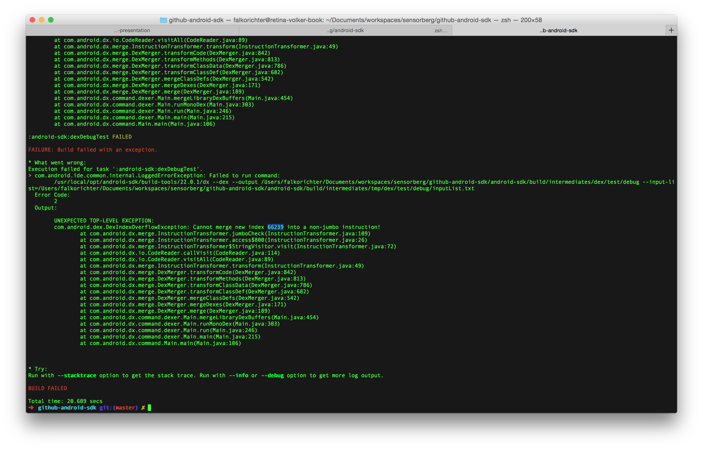
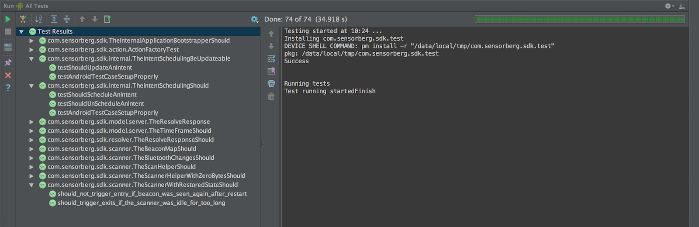
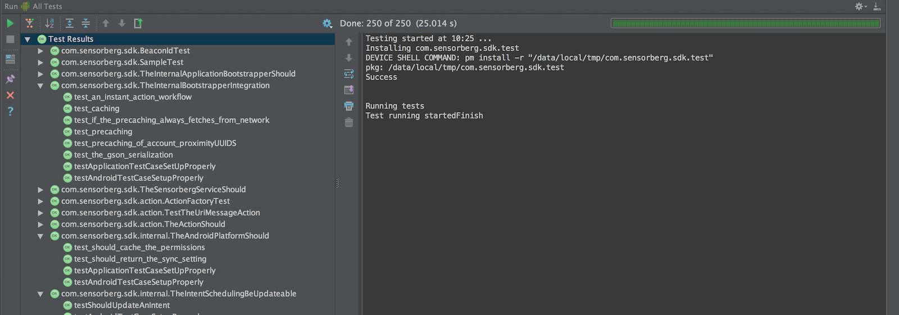
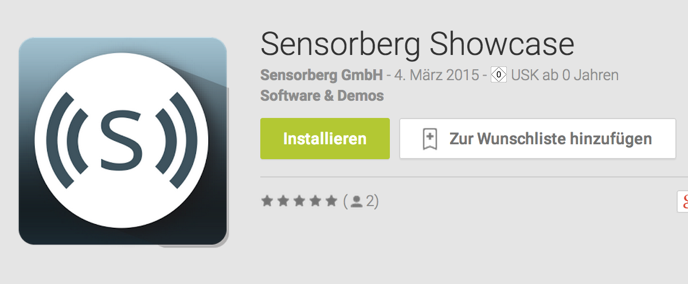
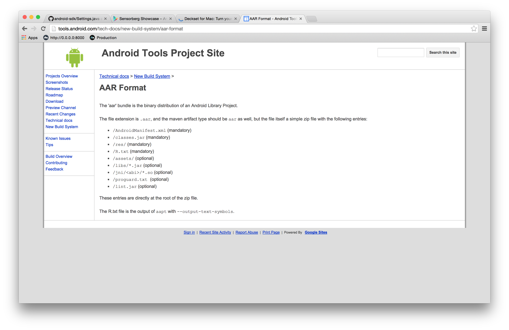
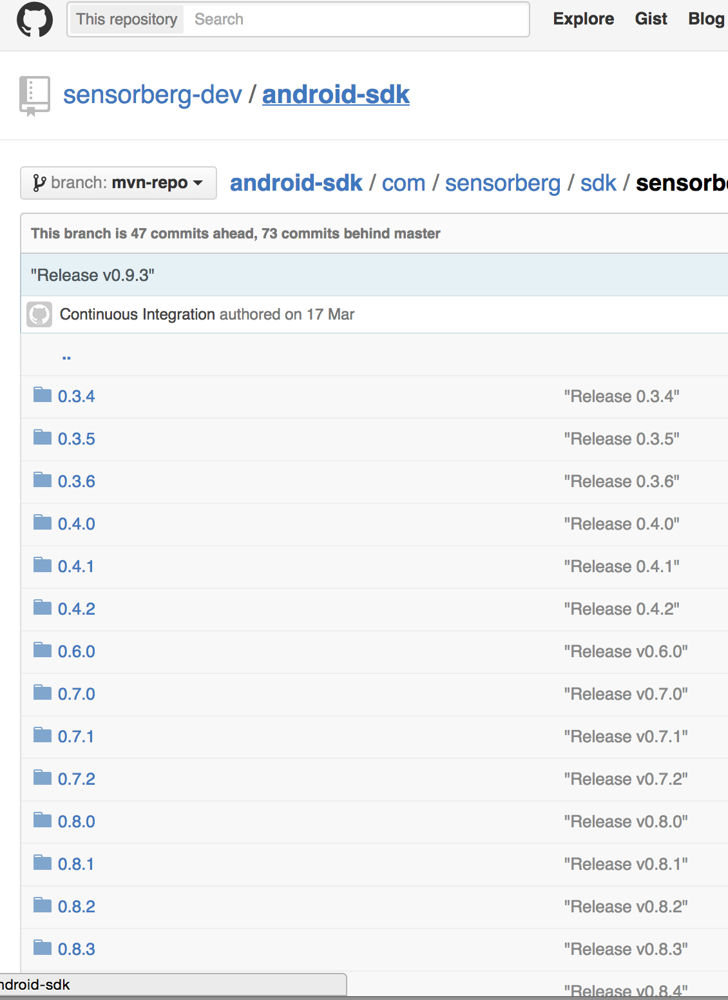
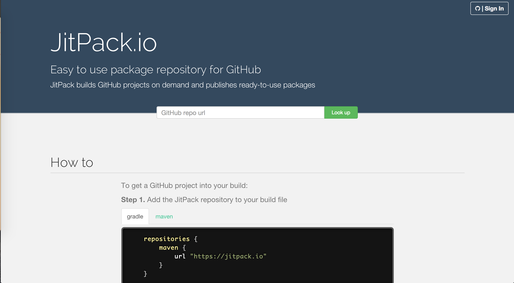
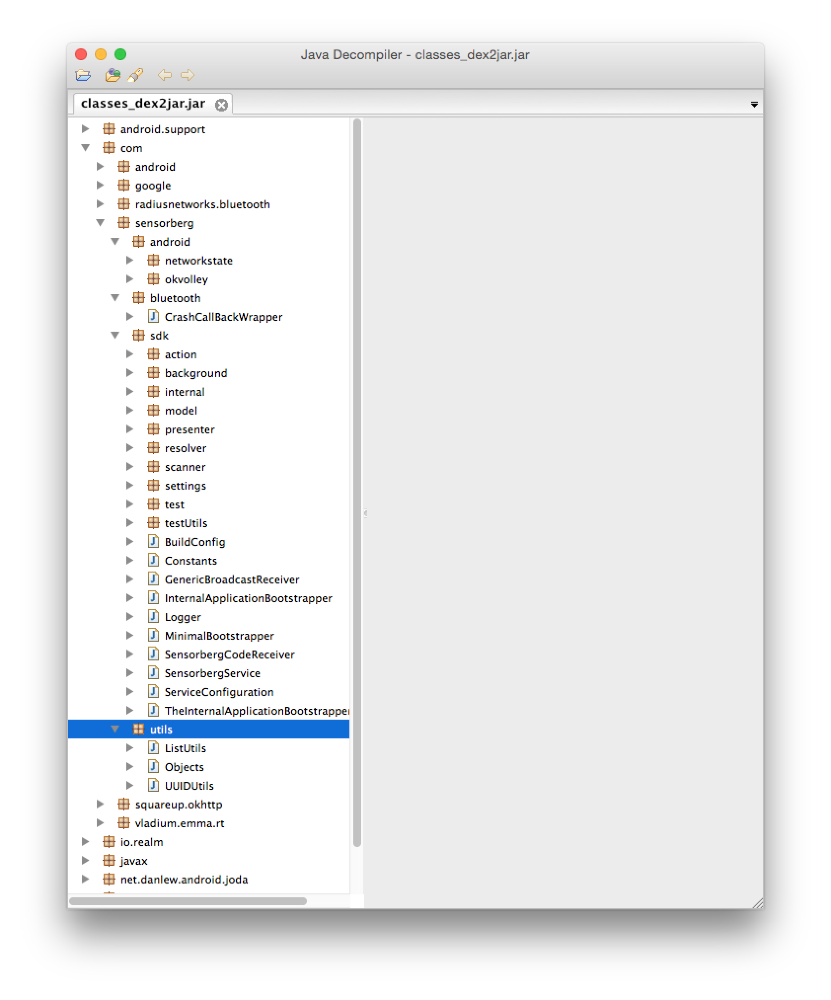
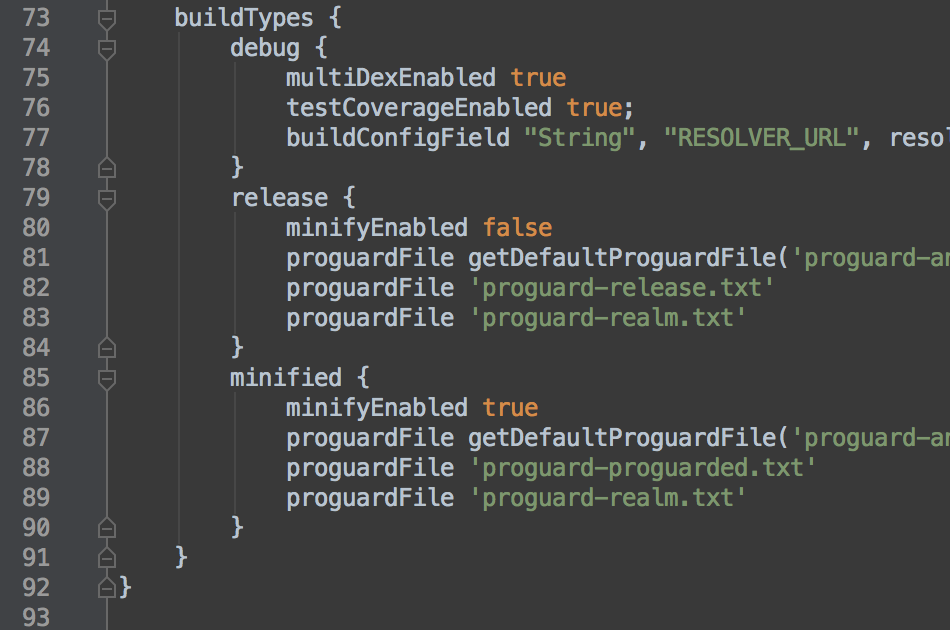

# Building a SDK[^1]
### learnings from building the sensorberg Android SDK
##### git clone https://github.com/falkorichter/presentations;cd building-a-SDK
##### pull requests are welcome!


[^1]: Presentation made with [DecksetApp](http://decksetapp.com/) 

---

#about sensorberg

* integrate iBeacon interactions in your apps
* complete solution
	* iOS, Android, Windows SDK
	* Showcase apps, Utilities
	* Campaign management Backend + Frontend
* lot´s of open source software

WE`RE HIRING -> sensorberg.com/jobs

---

#shameless plug:

#tune your podcatchers to androidpodcast.de[^2]


[^2]: better SSL support coming soon

---
# [fit] about me
github.com/falkorichter
@volkersfreunde
mobile software developer @ Sensorberg & proud dad since 1515
[about.me/falkorichter](http://about.me/falkorichter)
pilot of small things™ -> contact me for Berlin FPV racing

---

# #awwww


---

#Building a SDK

[open source](http://developer.sensorberg.com/android/) at developer.sensorberg.com/android/
many learnings and good practices
all samples from actual problems
all code (used to be) live

---

#general thoughts

listen to your customers
new features tailored to individial customers
don´t listen to customers, you are the expert
release early, release often (at least internally)

---


#think twice
#about everything

> sure let´s move this class, wait, a customer is using it, all his code will not compile...

 
his imports are broken

---

#offer support

github issues
zendesk
gitter.im chat [^3]
telephone
workshops

**direct interaction might be the best**

[^3]: https://gitter.im/sensorberg-dev/android-sdk


---

#logging


ship a powerfull logging engine!
domain logging output
disable all log output by default
logging can be turned on
ideally log4j

* log to file, send to developers...
* log to server

---

#VolleyLog.java

```
/**
 * Logging helper class.
 * <p/>
 * to see Volley logs call:<br/>
 * {@code <android-sdk>/platform-tools/adb shell setprop log.tag.Volley VERBOSE}
 */
public class VolleyLog {
    public static String TAG = "SensorbergVolley";

    public static boolean DEBUG = Log.isLoggable(TAG, Log.VERBOSE);
```
Check VolleyLog.MarkerLog for useful domain specific logging

---

#Logger.log.logError(e)

```
public class Logger {

    public static Log log;
```

* our custom Logger interface
* using secret codes to enable logging at runtime

---

#testing

no fancy setup
recently switched to Espresso 2.0 with JUnit 4
add your own testrunner from the very start
test on devices

---

#testing - multidex



our list of test dependencies

```
	androidTestCompile 'com.squareup:fest-android:1.0.8'
    androidTestCompile 'org.mockito:mockito-core:1.9.5'
    androidTestCompile 'com.google.dexmaker:dexmaker:1.0'
    androidTestCompile 'com.google.dexmaker:dexmaker-mockito:1.0'
    androidTestCompile ('com.android.support.test.espresso:espresso-core:2.0'){
        exclude group: 'com.squareup', module: 'javawriter'
    }
    androidTestCompile 'com.android.support.test:testing-support-lib:0.1'
    androidTestCompile 'org.apache.commons:commons-io:1.3.2'
    androidTestCompile('com.squareup.okhttp:mockwebserver:2.1.0') {
        exclude group: 'com.squareup.okhttp'
    }
    androidTestCompile 'org.apache.commons:commons-io:1.3.2'
```

we are having the multidex problem 😳

---
#multidex test project

```
androidTestCompile ('com.android.support:multidex:1.0.0')
```

```
public class SensorbergTestRunner extends android.support.test.runner.AndroidJUnitRunner {

    @Override
    public void onCreate(Bundle arguments) {
        MultiDex.install(getTargetContext());
        super.onCreate(arguments);
``` 
* not all tests found and executed on Dalvik, but no crashes
* no problems with ART

---




---

#dogfooding

use services like hockeyapp
"release early, release often"
play alpha & beta
you want problems with your SDK/library happen to a colleague

---


#build an app



be your own customer

build your own sample apps

build lot´s of samples

answer integration question with samples

"developer mode"

---

#build process
make sure you can release at the speed you wish, if neccesary every hour. 

Bugs are okay, if you can fix them within hours and deploy them that fast, customers will be impressed.


---

# [fit] gradle 

# ❤️❤️❤️

---



´´´
/AndroidManifest.xml (mandatory)
/classes.jar (mandatory)
/res/ (mandatory)
/R.txt (mandatory)
/assets/ (optional)
/libs/*.jar (optional)
/jni/<abi>/*.so (optional)
/proguard.txt (optional)
/lint.jar (optional)
´´´

[^4]: http://tools.android.com/tech-docs/new-build-system/aar-format

---

#fatjar / fataar

fataar  = aar with all dependencies

not solved:
 * http://stackoverflow.com/questions/28605367/library-with-bundles-dependencies-fat-aar
 * https://github.com/vRallev/jarjar-gradle

---

#releasing

jcenter ftw

your own public nexus

github pages



---

#github pages

check **uploadGithub.gradle** and **verifyTasks.gradle**

 * clone repo, deploy artifact, push to mvn-repo
 * be strict: don´t remove releases, don´t override releases
 
```
repositories {
    maven {
        url "https://raw.github.com/sensorberg-dev/android-sdk/mvn-repo";
    }
}
```

---

#jitpack.io

> Easy to use package repository for GitHub



[^6]: https://jitpack.io/

---


#architecture

* everything should be testable (if you need to)
* mock sever requests
* mock device callbacks
* blocking threading for tests

---


##Dependency injection

do.it.

---

##Platform class

our cheap dependency injection pattern

abstracts all Android specific code
Bluetooth callbacks
Threading

---

#Settings.java

have many internal settings
build an API for remote changing them

document them to individual customers/users
good for testing as well

---

#feature flags

use the settings or other measures.
ship code early, activate later
test on production code

---

##native dependencies

it works

we´re shipping with realm.io as a depency

gradle ftw

---


#secret codes

```
*#*#code#*#* in the dialer
```
* enable features at runtime
* no persistence!
* good for switching environments


---


#reviews

you are alone

you know nothing.

review your code

explain it to colleagues

invite somebody external

talk about it at a conference, meetup...

---

#dependencies

choose wisely

be forward compatible

be aware of updates, at least test with newer dependencies

update your SDK regularly to use the latest dependencies

---
#dependencies


"Name Mangling"
-> change the package of dependencies if neccesary

1. clone
2. change package
3. push
4. release [^7]

[^7]: https://bintray.com/sensorberg/maven


---

##volley

repackage volley (git subtree)

volley is super powerfull and you should use it


---

#security?



You ship a jar/aar with class files
JD-Gui -> java

> all your source are belong to every customer

Decide who you trust, it´s really hard to hide from your host app

---

#security?

if you really want to be safe, pull all the strings

SSL pinning:

* customer can override the cert check

---


#obfuscation

proguard ftw

* we never choose to ship proguarded code
* usefull when stripping unused classes 
	* ship an proguard rules file and let the customer decide

dexguard might be better (no experience)

harder troubleshooting

---

#proguard

check android-sdk/build.gradle
release a proguard file for your application



---
#Questions

pull request, issues on github
falko@sensorberg.com about sensorberg
@volkersfreunde for everything else

slides[^5]: 

[^5]: https://github.com/falkorichter/presentations
