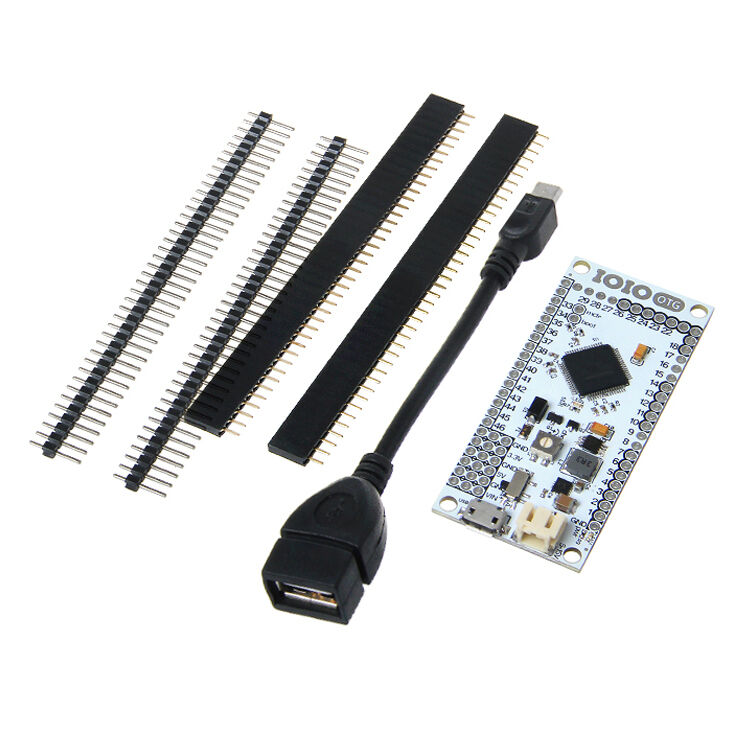
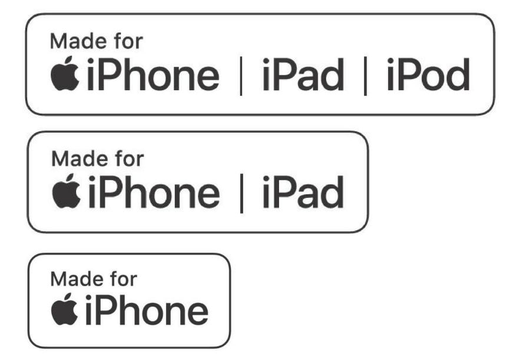
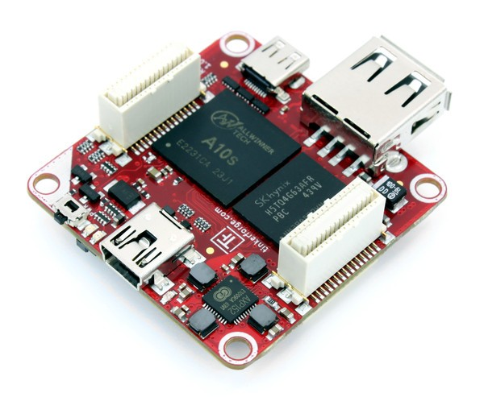
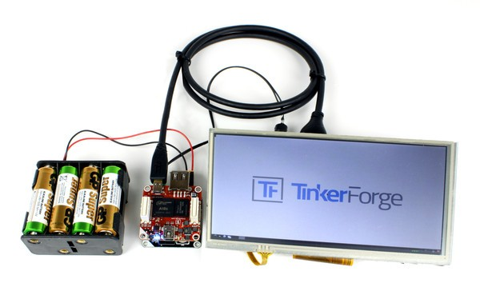

# Agile Hardware Development
## if you can do mobile, you can do hardware[^1]

######this presentation is open source: [github.com/falkorichter/presentations](https://github.com/falkorichter/presentations)

[^1]: Presentation made with [DecksetApp](http://decksetapp.com/) 

---

All details about hardware in this presentation can be derived from the hardware itself and do not contain any internal company secrets. Additional information might be derived from public documentation.

---

# making is possible

* *Maker movement* meets
* *Agile Craftsmanship* meets
* *Rapid electronic production* capabilities meets
* *China


---

highlights in history of IOT from a mobile perspective:

* MFI hardware (Apple)
* IOIO
* Bluetooth




---

# Bluetooth

<insert angels singing here>

# Wifi

<insert angels singing here>


---
## open source hardware for prototyping:

* tinkerforge

<show some hardware>



---

* https://store.gumstix.com/products
   * https://www.gumstix.com/raspberry-pi-family/
   *


---

---

# sample sensorberg

* pi compute module
* security (Security-Sheet.pdf)[https://documents.sensorberg.com/de/security-sheets/Security-Sheet-Sensorberg.pdf]

https://www.raspberrypi.org/documentation/hardware/computemodule/cm-emmc-flashing.md


---


```
echo "23" > /sys/class/gpio/export
echo "out" > /sys/class/gpio/gpio23/direction
echo "1" > /sys/class/gpio/gpio23/value
echo "0" > /sys/class/gpio/gpio23/value
```

---

pi compute module

* http://www.embest-tech.com/
* see [Companies using the RPI Compute module](documents/BH-CompaniesusingtheRPIComputemodule-130419-2003.pdf)

* see []()

---

# Gepetto

* https://www.gumstix.com/geppetto/

* https://www.gumstix.com/projects/mininodes-5-node-rpi-cm3/
* https://twitter.com/miniNodes/status/1088566102924320769/photo/1?ref_src=twsrc%5Etfw%7Ctwcamp%5Etweetembed%7Ctwterm%5E1088566102924320769&ref_url=https%3A%2F%2Fwww.gumstix.com%2Fprojects%2Fmininodes-5-node-rpi-cm3%2F


---
# Breadboarding


---
ESD protection


---
Certification


---
Professional case

* bopla
* apra plast
* takachi

---
where to go to:

* embedded world
* electronica
* maker faire

---
sources:

* sparkfun
*

---
shopping:

If you want to buy electronics online here a selection of good shops
* http://www.watterott.com/
* http://lipoly.de/
Berlin:
* http://www.segor.de/
* http://elmicro.com/index.html
* reichelt.de
* sparkfun.com
* http://www.adafruit.com/
* http://www.pollin.de/ [added 2015-04-13]
* http://www.mouser.com/ [added 2015-04-13]
* http://de.rs-online.com/web/[added 2015-04-13]
* exp-tech.de [added 2018-05-18] smaller but also good

* http://www.tinkersoup.de/
* http://www.element14.com/

just in case: (http://www.conrad.de/ce/)
* untested:https://www.modmypi.com/

from https://www.volkersfreunde.de/elektronik-online-shops/
