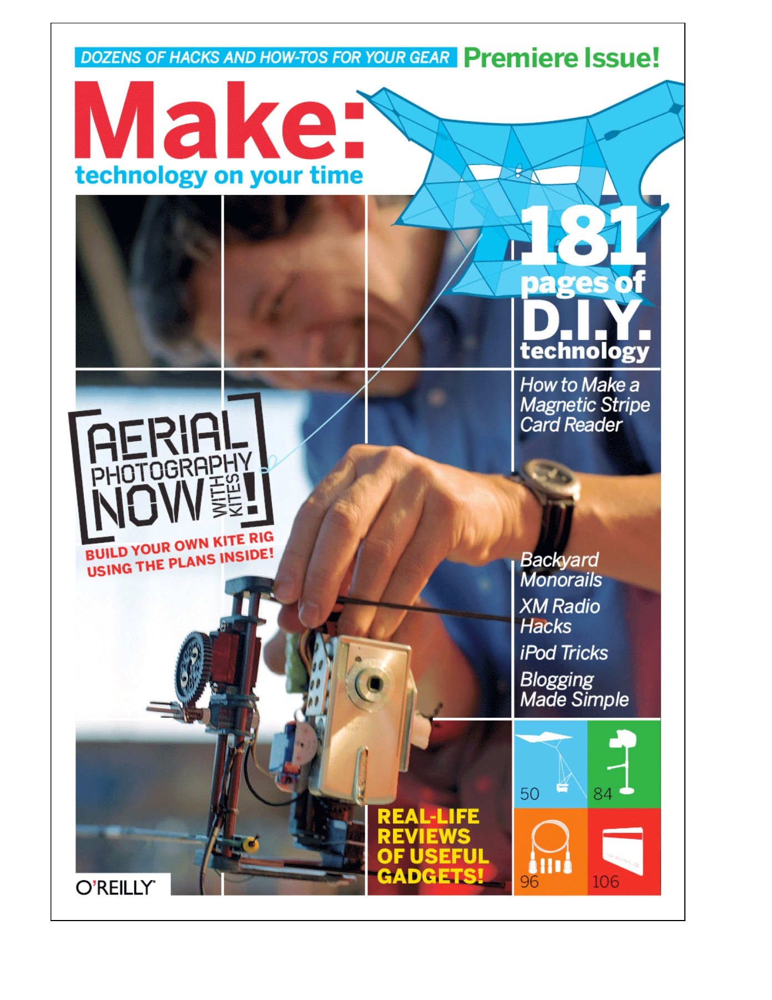
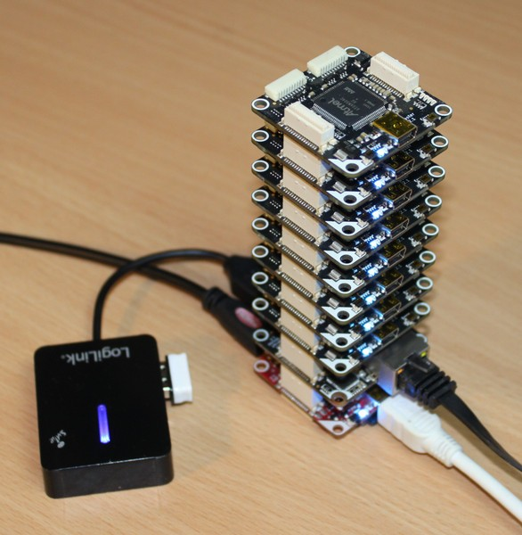

# Agile Hardware Development


---

# Agile Hardware Development
## if you can do mobile, you can do hardware[^1]

######this presentation is open source: [github.com/falkorichter/presentations](https://github.com/falkorichter/presentations)

[^1]: Presentation made with [DecksetApp](http://decksetapp.com/) 

---
# disclaimer:

All details about hardware in this presentation can be derived from the hardware itself and do not contain any internal company secrets. Additional information was derived from public documentation.

---

# why S2 / swipe?

[kiekmo](https://sinnerschrader.com/work/kiekmo/)
[digital foosball table](https://github.com/sinnerschrader/digitalfoosball)
[VW emil](https://de.wikipedia.org/wiki/VW_eT!)
java / kotlin | swift
[```#s2-iot```](https://app.slack.com/client/T02T629VC/C5K92SXKL)


---

highlights in history of IOT from a mobile perspective:

* MFI hardware (Apple)
* IOIO
* Bluetooth


---

# Bluetooth

<insert angels singing here>

# Wifi

<insert angels singing here>

---

# agile Development

* continous delivery
* kiss [^2]
* collective code ownership
* ...


[^2]: Keep it simple, stupid

---

# iterate on hardware ❓

# iterate on software ✅

---

# problems when iterating on hardware
* knowledge (hardware)
* tools (electronics design, os)
* manufacturing (price + speed)

---

# news

* Maker movement* meets *Agile Craftsmanship* meets *Rapid electronic production* capabilities meets *China*

* [jlpcb](https://jlcpcb.com) / [aisler.net](https://aisler.net/)
* open (source) hardware
  * [tindie.com](https://tindie.com) - store for open hardware
  * [kicad](https://www.kicad-pcb.org/)
* platforms
  * raspberry pi / ESP / NRF
  * [micropython](https://micropython.org/)



---

# jlpcb

[50 pcb (business cards)](https://www.instagram.com/p/BwnTBbjnfw3/)
```PCB Batchs	8534009000	Y1	50	€0.6979	€34.89```


---

# prototype manufacturing

order PCB
order parts
apply solder paste
hot air
repeat


---

## open source hardware for prototyping:

buy, connect, done

[github.com/Tinkerforge](https://github.com/Tinkerforge)

<show some hardware> [how it works](https://www.tinkerforge.com/en/home/how-it-works/)



---
phidgets

> Phidgets are programmable, modular USB devices, either sensors or controllers that you can connect together. Simply write code in your favorite language and solve real-world problems.


---

# pi compute module
* industrial raspberry as a module
  * see [Companies using the RPI Compute module](documents/BH-CompaniesusingtheRPIComputemodule-130419-2003.pdf)
* powerful, small, not cheap
* plug and play
  * develop software on prototype, swap into final hardware


---

### gumstix geppetto

* [https://store.gumstix.com/products](https://store.gumstix.com/products)
* [https://www.gumstix.com/raspberry-pi-family/](https://www.gumstix.com/raspberry-pi-family/)

<show some hardware> [gepetto](https://geppetto.gumstix.com/#!/dashboard)

---

# NRF
nordic semi conductos
bluetooth
many open source samples [uart](https://infocenter.nordicsemi.com/topic/com.nordic.infocenter.sdk5.v15.3.0/ble_sdk_app_nus_c.html)

OpenSK: [rust anyone?](https://github.com/google/OpenSK)


---
# the last mile

ESD protection [^3]
  stay < 48V, go to a lab
Certification
  "spurious emissions"
  pre-certification helps
case
cables + connectors (avoid, use standards)
mass production


[^3]: electrostatic discharge protection

---
# nobody wants naked electronics:

* [bopla](https://www.bopla.de/dienstleistungen.html)
* [apra plast](https://www.apra.de/produktkategorie/individuelle-gehause/)
* [takachi](http://www.takachi-enclosure.com/data/p_09handheld.html)

<talk about embedded world 2018>

* 3D print, injection mold...

---

# sample sensorberg

* pi compute module
* poe
* expandability (keypad, lockers)
* secure: [Security-Sheet.pdf](https://documents.sensorberg.com/de/security-sheets/Security-Sheet-Sensorberg.pdf)

---
# where to go to:

* embedded world
* electronica
* maker faires
* chaos congress/camp

---
# sources for inspiration:

* sparkfun
  * [new products](https://www.sparkfun.com/categories/new_products) [yt](https://www.youtube.com/user/sparkfun/videos)
* adafruit
  * [new products](https://www.adafruit.com/new) [yt](https://www.youtube.com/user/adafruit/videos)

---

overflow
