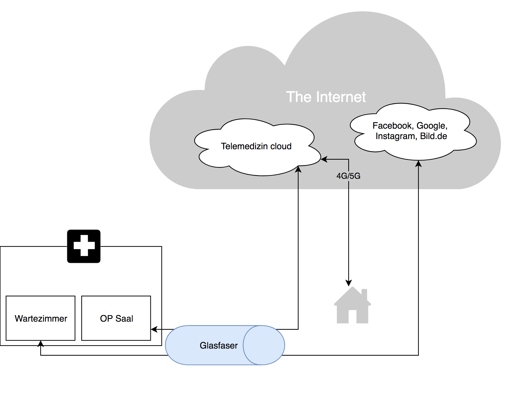

# Ein kleiner Netzpolitischer Abend

---

## Die Zukunft ist bereits hier

### sie ist nur ungleichmässig verteilt

* Ich digitalisiere
  * palm, Android, iPhone, Gebäude
  * euch?

---

# Ihr seid potentiell die wahren Influencer

---

# Heute Abend

## Netzneutralität
## Offenes Internet
## Anekdoten

---

#Netzneutralität

Netzneutralität bezeichnet die Gleichbehandlung von Daten bei der Übertragung im Internet und den diskriminierungsfreien Zugang bei der Nutzung von Datennetzen. Netzneutrale Internetdienstanbieter behandeln alle Datenpakete bei der Übertragung gleich, unabhängig von Sender und Empfänger, dem Inhalt der Pakete und der Anwendung, die diese Pakete generiert hat. [^1]

[^1]: [de.wikipedia.org/wiki/Netzneutralit%C3%A4t](https://de.wikipedia.org/wiki/Netzneutralit%C3%A4t)

---

#Unsinn

Autonome Autos benötigen auch eine Datenüberholspur [^2]

Telemedizin[^3]

"Free Basic" by Facebook[^4]

[^2]: [golem.de/news/netzneutralitaet-autonome-autos-brauchen-netz-und-mikrochips-sind-knusprig-1503-113137.html](https://www.golem.de/news/netzneutralitaet-autonome-autos-brauchen-netz-und-mikrochips-sind-knusprig-1503-113137.html)

[^3]: [taz.de/!5246120/](http://www.taz.de/!5246120/)

[^4]: [handelsblatt.com/unternehmen/it-medien/facebook-initiative-zuckerbergs-plan-b-fuer-indien/14018044.html](http://www.handelsblatt.com/unternehmen/it-medien/facebook-initiative-zuckerbergs-plan-b-fuer-indien/14018044.html)

---

---

#Sinn

* Infrastuktur / Gesellschaft[^5]
* Glasfaser überall[^6]
* 4G/5G ohne Bandbreitenbegrenzung[^7]
* Netz und Netzbetreiber trennen (Schweden)[^8]

*Terrabit-Ausbau* statt Gigabit Ausbau

[^5]: Rechenzentren, flexible Arbeitgeber
[^6]: [teltarif.de/glasfaser-stockholm-99-prozent-breitband/news/68340.html](https://www.teltarif.de/glasfaser-stockholm-99-prozent-breitband/news/68340.html)
[^7]: [focus.de/digital/handy/opensignal-ranking-lte-geschwindigkeit-eine-studie-zeigt-wie-desastroes-deutschland-abschneidet_id_8588411.html](https://www.focus.de/digital/handy/opensignal-ranking-lte-geschwindigkeit-eine-studie-zeigt-wie-desastroes-deutschland-abschneidet_id_8588411.html)
[^8]: [connect.de/ratgeber/glasfaser-ausbau-probleme-internet-breitband-3198153.html](http://www.connect.de/ratgeber/glasfaser-ausbau-probleme-internet-breitband-3198153.html)

---

#Offenes Internet

* Domain kaufen
* Webseitenbaukasten
* Crossposting gerne erlaubt
  * Link zum Artikel
  * Instagram mit Fotos
  * owncloud/nextcloud
  * Google
* trefft bewusste Entscheidungen  

---

#Anekdoten

---

##Telearbeit

* Büro hat 25MBit synchron, Berlin Mitte, Potsdamer Platz

Home Office mit Video Räumen - geht nicht

Google Hangouts | Cisco | appear.in | doublerobotics.com[^9]

[^9]: Oder der hier [segwayrobotics.com](http://www.segwayrobotics.com/)

---

#Wohnung in Berlin?

Ein Glück mit Glasfaser im "Medienverteiler"

---
#Schwedentrip
Whatsapp Standleitung nach Berlin im Fahrstuhl

 

---

#Whatsapp Video mit Oma

---

factory Berlin

---

#Zukunft der Arbeit?

* Büro für Firmen
* freie Flächen für Telearbeiter/Freiberufler
* Vernetzung
* lokales Rechenzentrum mit Wärmekopplung an der Heizung

---

Weiter hören?

logbuch-netzpolitik.de

Diese Präsentation ist open source:
[github.com/falkorichter/presentations/tree/master/netzpolitischer%20Abend](https://github.com/falkorichter/presentations/tree/master/netzpolitischer%20Abend
)

