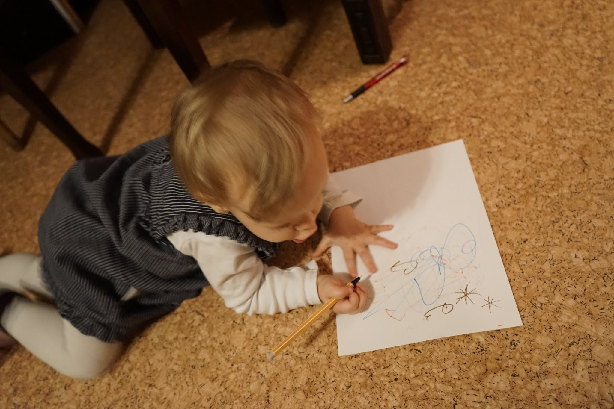
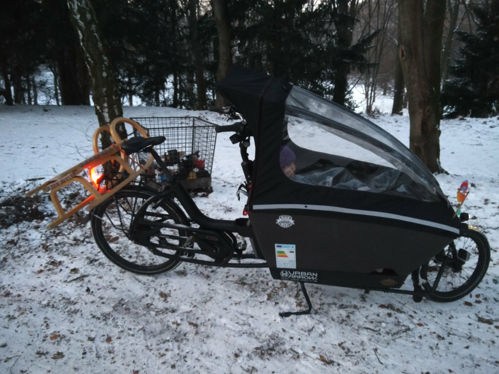
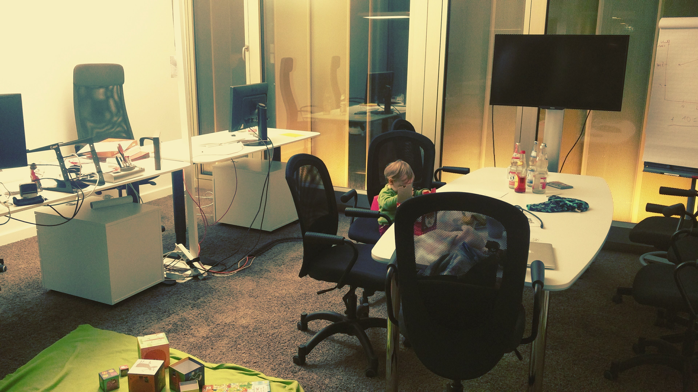
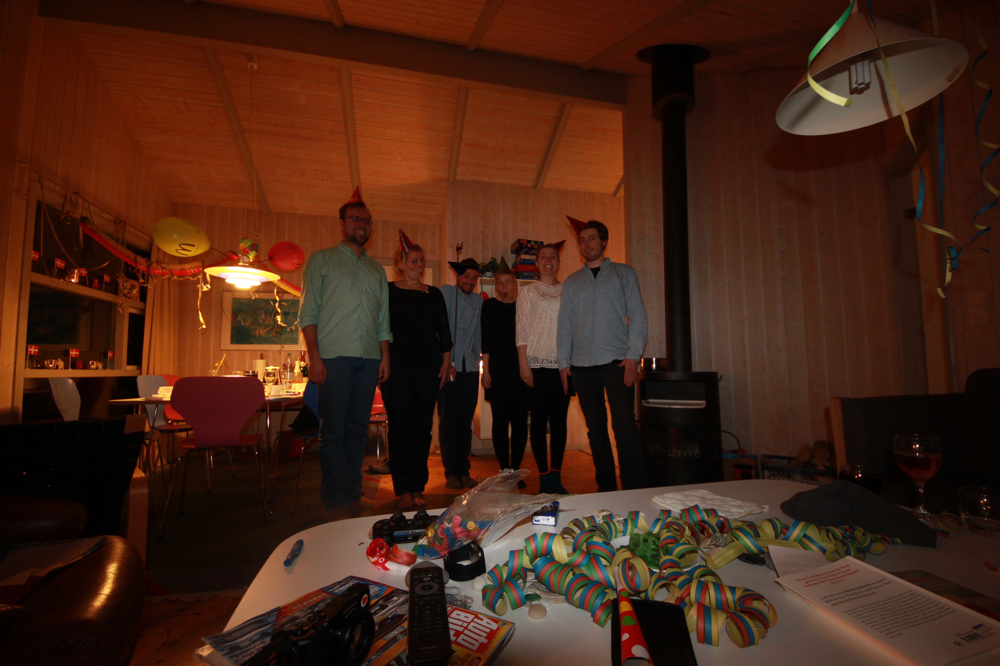

# Part time CTO
## in a start-up[^1]

######this presentation is open source: [github.com/falkorichter/presentations](https://github.com/falkorichter/presentations)

[^1]: Presentation made with [DecksetApp](http://decksetapp.com/) 

---

# About me [^2]

* 31 years old/young
* CTO since May 1st 2015
* **proud** dad since May 1st 2015 #maydaygirl
* distance to grandparents ~250k
* wife is working 

[^2]: [about.me/falkorichter](https://about.me/falkorichter)

---

# sensorberg
* 3,5 years old
* lot´s of software engineers (fathers, single dads, part time project managers)
* complex technology, real experts needed
* small team **(still)**

---

# why talk about **this**?

---

* **everybody** I talk to think it´s **great**
* you have to fight/**ask** for it **(still)**
* it has advantages **(for all involved parties)**
* we (guys) have much to learn

---

#challenges startup

* tight deadlines
* investors which expect 80 hour weeks
* lot´s of business chalenges
* recruiting

---

#facts

80% contract 
limited to 6 months, no autorenewal

---

#how do I do it

Fridays off **"If it´s urgent, call me even on a friday, I don´t want to clean up a mess every monday"**
Monday - Thursday everything is regular
**crunch times may interupt my schedule** I actually have one day buffer per week
I don´t believe in overtime, my productivity has a natural limit. **I have to pick up my daughter every wednesday at 4pm**

---

## Why did I do this?
#### #work-life-balance
## I love my job...

---

# I also love...

---

#...other

---

#...things

---

# outside reception

* **people are wishing me "happy weekend on thursday"**
my weekend is also Saturday & Sunday
* **"your alone-spa-day"**
I´ve always got stuff to do
This is why I need one day extra to things done

---

Imagine a freelance coworker who always has another client on Friday

You don´t treat him any special on a Thursday, right?

---

Advantages (for the company)

sensorberg saves 20% of my salary, looses <20% productivity
part time agreement for 6 months
competitive hr advantage
crunch time buffer

---

# advantages

I don´t burn out
I have one day to get my head free #creativity
I don´t answer to recruiters
crunch time buffer

---

#final thoughts

* prolong contract? most likely
* 80% is a good compromise
* four 100% days a week works best for me.
* combine with flexi leave

---

#talking points

* tandemploy
* Elternzeitgesetz
* hiring is difficult, keeping employees as well

---

#Thank you
##questions?

######[github.com/falkorichter/presentations](https://github.com/falkorichter/presentations)
[^3]: All images cc-by-nc-sa
